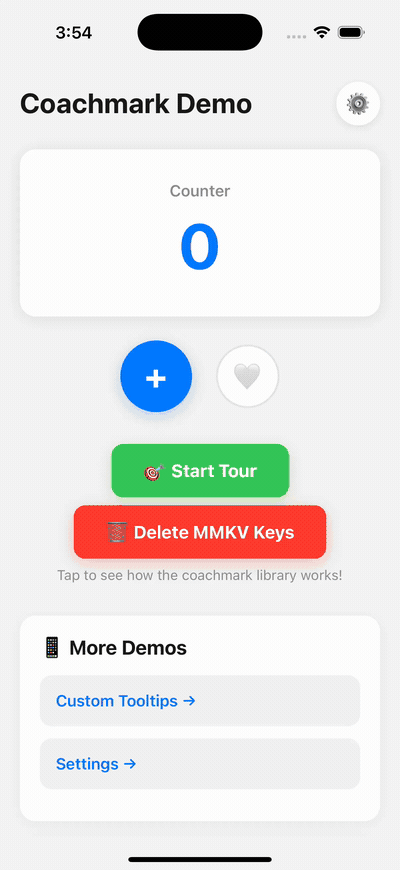

<h1 align="center">React Native Coachmark</h1>

<p align="center">
  Beautiful, performant Coach Mark library for React Native with smooth animations, customizable tooltips, and TypeScript support. Create engaging product tours and onboarding experiences.
</p>

<p align="center">
  <a href="https://github.com/edwardloopez/react-native-coachmark/actions/workflows/ci.yml"></a>
  <a href="https://www.npmjs.com/package/@edwardloopez/react-native-coachmark"></a>
  <a href="https://bundlephobia.com/package/@edwardloopez/react-native-coachmark"></a>
  <a href="https://opensource.org/licenses/MIT"></a>
</p>

<p align="center">
  
</p>

## ✨ Features

- 🎨 **Multiple shapes** - Circle, rounded rectangle, and pill shapes
- 📱 **Smart positioning** - Auto-placement with boundary detection
- 🔄 **Auto-scroll** - Automatically scroll to off-screen elements
- ♿️ **Accessible** - Screen reader support and reduced motion
- 💾 **Show once** - Built-in persistence (never annoy users twice)
- 🎭 **Themeable** - Light/dark modes and custom styling
- 🔧 **Custom tooltips** - Full control with render props
- 🎯 **Lifecycle hooks** - onEnter, onExit, onBeforeEnter, onBeforeScroll
- ⚡️ **Performant** - No screenshots, pure vector masking
- 📦 **TypeScript** - Full type safety included
- 🌐 **Cross-platform** - iOS, Android, and Web

## 📦 Installation

```bash
npm install @edwardloopez/react-native-coachmark react-native-svg react-native-reanimated
```

### Required Dependencies

This library depends on:
- **react-native-svg** (≥13.0.0) - For vector graphics
- **react-native-reanimated** (≥3.0.0) - For smooth animations

> **Note:** Follow the [Reanimated installation guide](https://docs.swmansion.com/react-native-reanimated/docs/fundamentals/getting-started/) to configure the Babel plugin.

### Optional: Persistence

For "show once" functionality, install one of these:

```bash
# AsyncStorage (most common)
npm install @react-native-async-storage/async-storage

# OR MMKV (faster, recommended)
npm install react-native-mmkv
```

## 🚀 Quick Start

### Step 1: Setup Provider

Wrap your app with the provider and add the overlay:

```tsx
import { CoachmarkProvider, CoachmarkOverlay } from '@edwardloopez/react-native-coachmark';

export default function App() {
  return (
    <CoachmarkProvider>
      <YourApp />
      <CoachmarkOverlay />
    </CoachmarkProvider>
  );
}
```

### Step 2: Mark UI Elements

Wrap elements you want to highlight:

```tsx
import { CoachmarkAnchor } from '@edwardloopez/react-native-coachmark';

<CoachmarkAnchor id="create-button" shape="circle">
  <Button title="Create" onPress={handleCreate} />
</CoachmarkAnchor>

<CoachmarkAnchor id="filters" shape="rect">
  <View style={styles.filters}>
    <Text>Filters</Text>
  </View>
</CoachmarkAnchor>
```

### Step 3: Create and Start Tour

```tsx
import { useCoachmark, createTour } from '@edwardloopez/react-native-coachmark';

function HomeScreen() {
  const { start } = useCoachmark();

  const startTour = () => {
    start(
      createTour('onboarding', [
        {
          id: 'create-button',
          title: 'Create New Item',
          description: 'Tap here to add a new item',
          placement: 'bottom',
        },
        {
          id: 'filters',
          title: 'Filter Results',
          description: 'Use these to narrow your search',
          placement: 'top',
        },
      ], {
        showOnce: true,  // Show only once per user
        delay: 500,      // Wait 500ms before starting
      })
    );
  };

  return <Button title="Start Tour" onPress={startTour} />;
}
```

## 📚 Documentation

- [Quick Start](#-quick-start)
- [API Reference](#-api-reference)
- [Advanced Usage](#-advanced-usage)
  - [Persistent Storage](#persistent-storage)
  - [Auto-Scroll](#auto-scroll-to-off-screen-elements)
  - [Lifecycle Hooks](#lifecycle-hooks)
  - [Custom Theme](#custom-theme)
  - [Custom Tooltips](#custom-tooltips)
- [Best Practices](#-best-practices)
- [Accessibility](#️-accessibility)
- [Complete Examples](#-complete-examples)
- [Showcase](#-showcase)
- [Contributing](#-contributing)

## 📖 API Reference

### Core Components

#### `<CoachmarkProvider>`
Root provider that manages tour state.

```tsx
<CoachmarkProvider theme={customTheme} storage={storageAdapter}>
  {children}
</CoachmarkProvider>
```

#### `<CoachmarkOverlay>`
Renders the spotlight and tooltip. Add once at app root.

#### `<CoachmarkAnchor>`
Marks elements for highlighting.

```tsx
<CoachmarkAnchor
  id="button-id"     // Required: Unique identifier
  shape="circle"     // 'circle' | 'rect' | 'pill'
  padding={12}       // Space around element (pixels)
  radius={8}         // Corner radius for rect/pill
  scrollRef={scrollViewRef}  // For auto-scroll feature
>
  {children}
</CoachmarkAnchor>
```

**Props:**
- `id` (required) - Unique identifier for this anchor
- `shape` - Spotlight shape (overrides step config)
- `padding` - Extra space around element
- `radius` - Corner radius for rounded shapes
- `scrollRef` - Ref to parent ScrollView/FlatList (required for `autoFocus`)

### Hook

#### `useCoachmark()`
Control tours programmatically.

```tsx
const { start, next, back, skip, stop, state } = useCoachmark();

// Start a tour
start(tour);

// Navigate
next();   // Next step
back();   // Previous step
skip();   // End tour

// Check state
state.isActive   // Is tour running?
state.index      // Current step (0-based)
```

### Functions

#### `createTour(key, steps, options)`
Create a tour configuration.

```tsx
const tour = createTour(
  'my-tour',                    // Unique identifier
  [
    {
      id: 'anchor-id',          // Anchor to highlight
      title: 'Title',           // Tooltip title
      description: 'Info',      // Tooltip description
      placement: 'bottom',      // Tooltip position
      shape: 'circle',          // Spotlight shape
    },
  ],
  {
    showOnce: true,             // Show only once
    delay: 500,                 // Start delay (ms)
  }
);
```

**Step Options:**
- `id` (required) - Anchor ID to highlight
- `title` - Tooltip title text
- `description` - Tooltip description text
- `placement` - `'top' | 'bottom' | 'left' | 'right' | 'auto'`
- `shape` - `'circle' | 'rect' | 'pill'`
- `padding` - Space around highlight (pixels)
- `radius` - Corner radius for rect/pill shapes (pixels)
- `autoFocus` - Auto-scroll behavior: `'always' | 'ifNeeded'`
- `scrollBehavior` - Scroll animation: `'smooth' | 'instant'`
- `scrollPadding` - Space from screen edges when scrolling (default: 20)
- `scrollDelay` - Delay after scroll before showing tooltip (ms, default: 150)
- `onBeforeEnter` - Async callback before step starts (return `false` to skip)
- `onBeforeScroll` - Async callback before auto-scrolling starts
- `onEnter` - Callback when step becomes active
- `onExit` - Callback when leaving step
- `renderTooltip` - Custom tooltip component for this step

**Tour Options:**
- `showOnce` - Show tour only once (requires storage)
- `delay` - Delay before tour starts (milliseconds)
- `renderTooltip` - Global custom tooltip renderer for all steps

## 🔧 Advanced Usage

### Persistent Storage

Enable "show once" functionality with storage:

```tsx
import { CoachmarkProvider, asyncStorage } from '@edwardloopez/react-native-coachmark';
import AsyncStorage from '@react-native-async-storage/async-storage';

<CoachmarkProvider storage={asyncStorage(AsyncStorage)}>
  {children}
</CoachmarkProvider>
```

Or use MMKV for better performance:

```tsx
import { mmkvStorage } from '@edwardloopez/react-native-coachmark';
import { MMKV } from 'react-native-mmkv';

<CoachmarkProvider storage={mmkvStorage(new MMKV())}>
  {children}
</CoachmarkProvider>
```

### Auto-Scroll to Off-Screen Elements

Automatically scroll to coachmark anchors that are outside the viewport:

#### Basic Setup

Link your `ScrollView` or `FlatList` to the anchor:

```tsx
import { useRef } from 'react';
import { ScrollView } from 'react-native';

function MyScreen() {
  const scrollRef = useRef<ScrollView>(null);

  return (
    <ScrollView ref={scrollRef}>
      {/* Pass scrollRef to anchors that need auto-scrolling */}
      <CoachmarkAnchor id="item-1" scrollRef={scrollRef}>
        <View>...</View>
      </CoachmarkAnchor>

      <CoachmarkAnchor id="item-2" scrollRef={scrollRef}>
        <View>...</View>
      </CoachmarkAnchor>
    </ScrollView>
  );
}
```

#### Auto-Focus Configuration

Control when and how scrolling happens:

```tsx
const tour = createTour('scroll-tour', [
  {
    id: 'bottom-item',
    title: 'Hidden Item',
    description: 'This will scroll into view automatically',

    // Auto-focus options:
    autoFocus: 'ifNeeded',     // Scroll only if element is off-screen
    // autoFocus: 'always',     // Always scroll, even if visible

    // Scroll behavior:
    scrollBehavior: 'smooth',  // Animated scroll (default)
    // scrollBehavior: 'instant', // Jump immediately

    scrollPadding: 50,         // Space from screen edges (default: 20)
    scrollDelay: 200,          // Wait after scroll before showing tooltip (ms)

    // Hook before scrolling:
    onBeforeScroll: async () => {
      console.log('About to scroll to element');
      // Prepare UI, collapse sections, etc.
    },
  },
]);
```

**Auto-Focus Modes:**
- `'ifNeeded'` - Scroll only if element is outside viewport (recommended)
- `'always'` - Always scroll to element, even if already visible
- `undefined` - No auto-scrolling (default)

**Scroll Behavior:**
- `'smooth'` - Animated scrolling with easing (default, waits ~300ms)
- `'instant'` - Immediate jump (waits ~50ms)

#### FlatList Example

```tsx
import { useRef } from 'react';
import { FlatList } from 'react-native';

function MyList() {
  const listRef = useRef<FlatList>(null);

  return (
    <FlatList
      ref={listRef}
      data={items}
      renderItem={({ item }) => (
        <CoachmarkAnchor
          id={`item-${item.id}`}
          scrollRef={listRef}
        >
          <ItemComponent item={item} />
        </CoachmarkAnchor>
      )}
    />
  );
}
```

> **⚠️ Important:** Without `scrollRef`, the `autoFocus` feature won't work and a warning will be logged.

### Lifecycle Hooks

Control tour flow and add custom logic at different stages:

```tsx
const tour = createTour('lifecycle-tour', [
  {
    id: 'step-1',
    title: 'Welcome',

    // Called when step becomes active
    onEnter: () => {
      console.log('Step entered');
      analytics.track('tour_step_viewed');
    },

    // Called when leaving this step
    onExit: () => {
      console.log('Step exited');
    },
  },
  {
    id: 'step-2',
    title: 'Conditional Step',

    // Called BEFORE step becomes active
    // Return false to skip this step automatically
    onBeforeEnter: async () => {
      const hasPermission = await checkPermission();
      if (!hasPermission) {
        return false; // Skip this step
      }
      // Return true or undefined to continue
    },
  },
  {
    id: 'step-3',
    title: 'Scroll Step',
    autoFocus: 'ifNeeded',

    // Called before auto-scrolling starts
    onBeforeScroll: async () => {
      // Collapse accordion, close modals, etc.
      await closeExpandedSections();
    },
  },
]);
```

**Available Lifecycle Hooks:**

| Hook | When It Fires | Use Cases | Can Skip Step? |
|------|---------------|-----------|----------------|
| `onBeforeEnter` | Before step activates | Check conditions, validate state | ✅ Yes (return `false`) |
| `onBeforeScroll` | Before auto-scrolling | Prepare UI for scroll | ❌ No |
| `onEnter` | After step activates | Analytics, highlight elements | ❌ No |
| `onExit` | When leaving step | Cleanup, track duration | ❌ No |

### Custom Theme

Customize colors, animations, and styling:

```tsx
<CoachmarkProvider
  theme={{
    // Backdrop (overlay behind spotlight)
    backdropColor: '#000000',
    backdropOpacity: 0.7,        // 0-1
    holeShadowOpacity: 0.3,      // Shadow around spotlight hole

    tooltip: {
      maxWidth: 320,              // Maximum tooltip width
      radius: 16,                 // Corner radius
      bg: '#1a1a1a',             // Background color
      fg: '#ffffff',             // Text color
      arrowSize: 10,             // Tooltip arrow size
      padding: 16,               // Internal padding
      buttonPrimaryBg: '#007AFF', // Primary button color
      buttonSecondaryBg: '#666',  // Secondary button color
    },

    motion: {
      durationMs: 300,           // Animation duration
      easing: (t) => t * t,      // Custom easing function (0-1)
    },
  }}
>
  {children}
</CoachmarkProvider>
```

**Complete Theme Type:**

```typescript
type CoachmarkTheme = {
  backdropColor: string;
  backdropOpacity: number;
  holeShadowOpacity: number;
  tooltip: {
    maxWidth: number;
    radius: number;
    bg: string;              // Background
    fg: string;              // Foreground (text)
    arrowSize: number;
    padding: number;
    buttonPrimaryBg: string;
    buttonSecondaryBg: string;
  };
  motion: {
    durationMs: number;
    easing: (t: number) => number;  // Easing function
  };
};
```

**Easing Functions:**

```tsx
// Linear
easing: (t) => t

// Ease out (default)
easing: (t) => 1 - Math.pow(1 - t, 3)

// Ease in-out
easing: (t) => t < 0.5
  ? 4 * t * t * t
  : 1 - Math.pow(-2 * t + 2, 3) / 2

// Bounce
easing: (t) => 1 - Math.cos(t * Math.PI) / 2
```

### Custom Tooltips

Build your own tooltip UI with full control:

```tsx
import type { TooltipRenderProps } from '@edwardloopez/react-native-coachmark';

function CustomTooltip({
  theme,           // Current theme
  title,           // Step title
  description,     // Step description
  index,           // Current step index (0-based)
  count,           // Total number of steps
  isFirst,         // Is this the first step?
  isLast,          // Is this the last step?
  onNext,          // Go to next step
  onBack,          // Go to previous step
  onSkip,          // Skip/finish tour
  currentStep,     // Complete step object
}: TooltipRenderProps) {
  return (
    <View style={styles.tooltip}>
      <Text style={styles.title}>{title}</Text>
      <Text style={styles.description}>{description}</Text>
      <Text style={styles.progress}>{index + 1} of {count}</Text>

      <View style={styles.buttons}>
        {!isFirst && (
          <Button title="Back" onPress={onBack} />
        )}
        <Button title="Skip" onPress={onSkip} />
        <Button
          title={isLast ? 'Done' : 'Next'}
          onPress={onNext}
        />
      </View>
    </View>
  );
}

// Use globally for all steps
const tour = createTour('my-tour', steps, {
  renderTooltip: CustomTooltip,
});

// Or override per step
const steps = [
  {
    id: 'special-step',
    title: 'Special Step',
    renderTooltip: CustomTooltip,  // Just for this step
  },
];
```

## 💪 Best Practices

- Keep tours **short** (3-5 steps max)
- Use `showOnce` to avoid repetition
- Add delays for screen transitions
- Prefer MMKV over AsyncStorage for performance
- Memoize custom tooltips with `React.memo()`
- Always provide `scrollRef` when using `autoFocus`
- Use lifecycle hooks for analytics and conditional logic
- Test tours with VoiceOver/TalkBack enabled

## 📋 Complete Examples

### Example 1: ScrollView with Auto-Scroll

```tsx
import { useRef } from 'react';
import { ScrollView, View, Text, Button } from 'react-native';
import {
  CoachmarkAnchor,
  createTour,
  useCoachmark
} from '@edwardloopez/react-native-coachmark';

function ScrollableList() {
  const scrollRef = useRef<ScrollView>(null);
  const { start } = useCoachmark();

  const startTour = () => {
    start(createTour('scroll-tour', [
      {
        id: 'header',
        title: 'Welcome',
        description: 'Let me show you around',
        placement: 'bottom',
      },
      {
        id: 'bottom-item',
        title: 'Hidden Feature',
        description: 'This was off-screen, but we scrolled here automatically!',
        placement: 'top',
        autoFocus: 'ifNeeded',
        scrollBehavior: 'smooth',
        scrollDelay: 200,
      },
    ]));
  };

  return (
    <View style={{ flex: 1 }}>
      <CoachmarkAnchor id="header">
        <View style={{ padding: 20 }}>
          <Button title="Start Tour" onPress={startTour} />
        </View>
      </CoachmarkAnchor>

      <ScrollView ref={scrollRef}>
        {/* ... lots of content ... */}

        {/* This anchor is linked to the scroll view */}
        <CoachmarkAnchor id="bottom-item" scrollRef={scrollRef}>
          <View style={{ padding: 20, margin: 20, backgroundColor: '#f0f0f0' }}>
            <Text>Bottom Item</Text>
          </View>
        </CoachmarkAnchor>
      </ScrollView>
    </View>
  );
}
```

### Example 2: Conditional Steps with Lifecycle Hooks

```tsx
function OnboardingTour() {
  const { start } = useCoachmark();
  const [isPremium, setIsPremium] = useState(false);

  const startOnboarding = () => {
    start(createTour('onboarding', [
      {
        id: 'welcome',
        title: 'Welcome!',
        description: 'Let\'s get you started',
        onEnter: () => {
          analytics.track('onboarding_started');
        },
      },
      {
        id: 'premium-feature',
        title: 'Premium Feature',
        description: 'This is only for premium users',
        // Skip this step if user is not premium
        onBeforeEnter: async () => {
          const userStatus = await checkUserStatus();
          return userStatus === 'premium';
        },
        onEnter: () => {
          analytics.track('premium_feature_shown');
        },
      },
      {
        id: 'finish',
        title: 'You\'re All Set!',
        description: 'Start exploring the app',
        onEnter: () => {
          analytics.track('onboarding_completed');
        },
        onExit: () => {
          // Cleanup or redirect
          navigation.navigate('Home');
        },
      },
    ], {
      showOnce: true,
      delay: 1000,
    }));
  };

  return <Button title="Start Onboarding" onPress={startOnboarding} />;
}
```

### Example 3: Custom Theme and Tooltip

```tsx
import { CoachmarkProvider } from '@edwardloopez/react-native-coachmark';

function CustomTooltip({ title, description, index, count, isLast, onNext, onSkip }) {
  return (
    <View style={{
      backgroundColor: '#2c3e50',
      borderRadius: 12,
      padding: 20,
      maxWidth: 300,
    }}>
      <Text style={{ color: '#fff', fontSize: 18, fontWeight: 'bold' }}>
        {title}
      </Text>
      <Text style={{ color: '#ecf0f1', marginTop: 8 }}>
        {description}
      </Text>
      <Text style={{ color: '#95a5a6', marginTop: 12, fontSize: 12 }}>
        {index + 1} of {count}
      </Text>
      <View style={{ flexDirection: 'row', marginTop: 16, gap: 8 }}>
        <Button title="Skip" onPress={onSkip} color="#e74c3c" />
        <Button
          title={isLast ? 'Done' : 'Next'}
          onPress={onNext}
          color="#3498db"
        />
      </View>
    </View>
  );
}

function App() {
  return (
    <CoachmarkProvider
      theme={{
        backdropColor: '#1a1a1a',
        backdropOpacity: 0.85,
        holeShadowOpacity: 0.4,
        tooltip: {
          bg: '#2c3e50',
          fg: '#ffffff',
          buttonPrimaryBg: '#3498db',
          buttonSecondaryBg: '#95a5a6',
        },
        motion: {
          durationMs: 400,
          easing: (t) => 1 - Math.pow(1 - t, 4), // Ease-out quart
        },
      }}
    >
      <YourApp />
      <CoachmarkOverlay />
    </CoachmarkProvider>
  );
}
```

## 🌟 Showcase

Using this library? [Open a PR](https://github.com/edwardloopez/react-native-coachmark/pulls) to add your app here!

<!-- Add your app:
- **[Your App Name](https://yourapp.com)** - Brief description
-->

## 🤝 Contributing

Contributions welcome! See [CONTRIBUTING.md](CONTRIBUTING.md) for guidelines.

## 🔗 Links

- [NPM Package](https://www.npmjs.com/package/@edwardloopez/react-native-coachmark)
- [GitHub Repository](https://github.com/edwardloopez/react-native-coachmark)
- [Issues](https://github.com/edwardloopez/react-native-coachmark/issues)

---

**Made with ❤️ for the React Native community**
